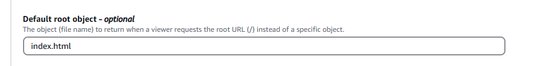

+++
title = "Hosting Static Websites on AWS: A Step-by-Step Guide"
date = 2024-12-09T00:00:00Z
+++

Static websites are a simple and effective way to share content online, and AWS provides powerful tools to host and scale them efficiently. This blog post walks you through a hands-on project to create and deploy a static website on AWS, leveraging S3, Route 53, and a range of other AWS services. The project is broken into four distinct phases, each building upon the last, to guide you from setting up basic hosting to implementing advanced features like CI/CD, monitoring, and infrastructure as code (IaC).

Whether you're brushing up on AWS skills from recent certifications or exploring new ways to optimize your workflows, this guide offers a clear, structured approach to mastering static website hosting on AWS. From configuring S3 buckets and custom domains to automating deployments with GitHub and enhancing performance with CloudFront, we'll cover it all.

Let’s get started!

## Overview of the Project

We'll host a simple static website on S3 with a custom domain name, applying tools and techniques to automate and enhance the process. Here's the plan:

### Tech Stack

**AWS Services**: S3, Route 53, ACM, CloudFront, CloudWatch, SNS, CloudFormation

**CI/CD Tools**: GitHub Actions

**Development Framework**: Next.js

### Project Phases

**1. Setup Static Hosting**: Host a basic static website on S3 and configure DNS with Route 53.

**2. Implement CI/CD**: Use GitHub to automate deployment of website updates to S3.

**3. Add Enhancements**: Integrate SSL/TLS, CDN, monitoring, and alerting for traffic management.

**4. Infrastructure as Code (IaC)**: Migrate all configurations to CloudFormation templates for reproducibility.

## Phase 1: Static Website Hosting

### Step 1: Create a Next.js Application

Start a new project with `npm create-next-app@latest site`. Use default configurations. Your repo should look like this:

```
repo-root/
├── site/ 
│ ├── app
│ ├── node_modules
│ ├── next.config.ts
│ └── ...
│
├── README.md 
└── .gitignore 
```

Test the development environment by running `npm run dev`.


Update the next.config.js file to enable static export at line 5. 


Then build the project using `npm run build`. This generates an `out` folder containing the website's static files.


### Step 2: Set Up S3 Bucket

Create an S3 bucket in the AWS console. The bucket name must match your intended domain (e.g., static-site.example.com).


Enable versioning and disable “Block all public access.”


Then, create the bucket, and upload the contents of the out folder to the bucket (just the contents, so that the "index.html" file is at the root level).


In the "Properties" tab, enable static website hosting and set index.html as the index document.


Go to the "Permissions" tab to edit bucket policy, in order to allow GET access to the public. Click on "Edit".


Then, paste the following policy, to allow `getObject` on all items under our s3 bucket to anybody.

```JSON
{
	"Version": "2012-10-17",
	"Statement": [
		{
			"Sid": "Statement1",
			"Principal": "*",
			"Effect": "Allow",
			"Action": "s3:GetObject",
			"Resource": "arn:aws:s3:::static-site.jiwanheo.xyz/*"
		}
	]
}
```

Once you hit save, and come back to the "Static website hosting" in the Properties tab, you should see a Bucket website endpoint.


### Step 3: Configure Public Route53 Access 

I happen to already have a hosted zone in AWS, so I'll be using that domain.

In your hosted zone, hit "Create record"


Create an "A" record that points to the website endpoint of our s3 bucket.


After this, the `static-site.jiwanheo.xyz` domain will point to our static website. It might take a few minutes for the DNS to propagate.


### Section wrap-up

We have the basic functionality working for our static website. We've explored two options to making a static website publicly accessible: using static site hosting in S3, and using an A record to point to the bucket.

With that, push your code upto Github, and let's move on to the next phase.

## Phase 2: Implement CI/CD

### Step 1: Set Up AWS Credentials in Github

Set up your AWS credentials (access key & secret access key) with Github. Within your repo, go to Settings -> Secrets and variables -> Actions.


Hit "New repository secret", and set up `AWS_ACCESS_KEY_ID` and `AWS_SECRET_ACCESS_KEY` with your creds. If you don't already have them, you can generate them from the IAM console.

### Step 2: Create GitHub Actions Workflow

Add a .github/workflows/deploy.yml file to automate builds and uploads to S3. Your directory should look like this:

```
repo-root/
├── .github/ 
│ ├── workflows
│ │ ├── deploy.yml
|
├── site/
│ ├── index.html
| ├── ...
│
└── README.md
```

In the deploy.yml, paste the following:

```YAML
name: Deploy Next.js to S3

on:
  push:
    branches:
      - phase2 # This will trigger the workflow when you push to the 'phase2' branch

jobs:
  build_and_deploy:
    runs-on: ubuntu-latest # This specifies the environment the job will run in

    steps:
      - name: Checkout code
        uses: actions/checkout@v2 # Checkout the code from your repository

      - name: Set up Node.js
        uses: actions/setup-node@v2
        with:
          node-version: "v21.7.1" # Specify the Node.js version you want to use

      - name: Install dependencies
        run: |
          cd site  # Navigate to the 'site' directory
          npm install  # Now 'npm install' will work in the correct directory

      - name: Build the app
        run: |
          cd site  # Make sure we are in the 'site' directory
          npm run build  # Run the build process

      # Install and start a local server to preview the build
      - name: Install http-server
        run: |
          cd site
          npm install -g http-server

      - name: Preview the site (Local Server)
        run: |
          cd site/out
          http-server -p 8080 &  # Run in background on port 8080
          sleep 10  # Allow some time for the server to start
          curl http://localhost:8080  # Test the server
```

Nothing very special about this yml file. The first few steps are very standard for checking out code, setting up node, installing dependencies, then building the app. Then after, I'm previewing the built site, then curl'ing the server, to see if it built correctly. If all goes well, we can replace this step with a new step that copies over files to S3 bucket.

I'll push this up, and github should automatically detect and run the workflow file.


### Step 3: Adjust IAM Permissions

The next step, is to ensure proper IAM permissions are set, that'll let us interact with S3.

To do this, go to the IAM console. My user already is an admin, so I don't have to do anything, but if not, you'd want to make sure to create a policy that covers actions like "s3:ListBucket", "s3:GetObject", "s3:PutObject", "s3:DeleteObject".


### Step 4: Complete GitHub Actions Workflow

Now that we have proper permissions, we're going to replace the "Install http-server" and "Preview the site (Local Server)" steps with actually deploying to S3.

```YAML
- name: Deploy to S3
  run: |
    cd site  # Ensure we are in the 'site' directory
    aws s3 sync out/ s3://static-site.jiwanheo.xyz --delete  # Deploy the 'out' folder to S3
  env:
    AWS_ACCESS_KEY_ID: ${{ secrets.AWS_ACCESS_KEY_ID }}
    AWS_SECRET_ACCESS_KEY: ${{ secrets.AWS_SECRET_ACCESS_KEY }}
    AWS_DEFAULT_REGION: 'us-east-2'
```

Push this up, and we should see that the S3 bucket is updated. We can see this in both the S3 static website link, and the Route 53 A record we set up.


### Section wrap-up

Great! To close this section, I'm going to change the YAML's target branch to main, as well as triggering it on PRs.

## Phase 3: Add Enhancements

### Step 1: Enable SSL/TLS with ACM

Request an SSL/TLS certificate for your domain in the ACM console. (Make sure you're in us-east-1 region)


If you click on the certificate that we just created, there should be a "Create records in Route 53" button. Click it, then create record. Validate the certificate by creating CNAME records in Route 53. Give it some time, and it should say "Issued".


### Step 2: Set Up CloudFront

Create a CloudFront distribution pointing to your S3 bucket.


Scroll down and set Viewer Protocol Policy to Redirect HTTP to HTTPS (for security).


I'm going to pass on WAF for now.


Fill in our domain "static-site.jiwanheo.xyz" in the Alternate domain name, and link it with the SSL cert we created.


Finally, have "index.html" as default root object.



Hit "Create distribution", and wait a few minutes for it to be enabled.

### Step 3: Update Route 53

We're going to remove the previously defined `static-site.jiwanheo.xyz` that links to the S3 bucket, and point it to the cloudfront distribution.

Delete the A record.


Fill it with the Cloudfront distribution.


Then we can visit "static-site.jiwanheo.xyz", to see it's redirected to https.


### Step 4: Enhance S3 Security

Let's make S3 bucket a little more secure, by making it private, and using OAC to grant CloudFront access.

From my CloudFront distribution, go to Origins section, and select the S3 origin, and edit.


And we'll create an OAC. Copy the policy.


Go to S3 bucket, and replace the existing policy with the new one. Then, block all public access.

After the Cloudfront distribution propagates, we can check that accessing the S3 bucket directly, gives 403 error.


However, accessing the cloudfront distribution through `static-site.jiwanheo.xyz` works.


### Step 5: Monitor and Manage Traffic

To optimize resource usage and manage AWS costs effectively, we will implement a monitoring and response system using AWS CloudWatch, SNS, and Lambda. The goal is to monitor traffic patterns and automatically handle traffic spikes by temporarily disabling the CloudFront distribution when necessary. Here's the overview of what we'll implement.

**Monitoring Traffic with CloudWatch**: CloudWatch will track the number of requests to the CloudFront distribution. If the traffic exceeds a predefined threshold, it will trigger an alarm. Similarly, a separate alarm will detect when traffic returns to normal levels.

**Notifying via SNS**: When the CloudWatch alarm is triggered, it will send a notification to Amazon Simple Notification Service (SNS). This allows for seamless integration and communication with other AWS services.

**Automated Response with Lambda**: A Lambda function subscribed to the SNS topic will automatically take action based on the alarm's state:

- High Traffic: The Lambda function will disable the CloudFront distribution to prevent excessive costs.

- Normal Traffic: When traffic levels normalize, the Lambda function will re-enable the CloudFront distribution.
This setup ensures an automated, cost-effective, and scalable solution to handle traffic fluctuations without manual intervention.

Go to the SNS console, and create a standard topic.


After you've created it, go into it, and create a subscription for our email. Click "Create subscription". This will send us an email anytime SNS receives a message from CloudWatch.


Go to Lambda console, and create a function from scratch. Give it a name, and select Python as runtime.


And paste the following into the editor, and deploy the function. This code reads the message from SNS, and determine which state the alarm is (in alarm/OK), as well as CloudFront distribution ID. Then, depending on the state, we disable/enable the distribution.

```python
import boto3
import json

# Create CloudFront client
cloudfront = boto3.client('cloudfront')

def lambda_handler(event, context):
    # Extract the SNS message
    sns_message = event['Records'][0]['Sns']['Message']

    # Parse the SNS message (which is JSON inside a string)
    alarm_details = json.loads(sns_message)

    # Extract details
    alarm_state = alarm_details['NewStateValue']

    # Extract CloudFront DistributionId from Dimensions
    trigger_details = alarm_details.get('Trigger', {})
    dimensions = trigger_details.get('Dimensions', [])
    distribution_id = None

    for dimension in dimensions:
        if dimension['name'] == 'DistributionId':
            distribution_id = dimension['value']
            break

    # Initialize CloudFront client
    client = boto3.client('cloudfront')

    try:
        # Get the current distribution configuration
        response = client.get_distribution_config(Id=distribution_id)
        config = response['DistributionConfig']
        etag = response['ETag']

        # Check current state and update 'Enabled' field based on alarm state
        if alarm_state == "ALARM":
            config['Enabled'] = False  # Disable the distribution
            action = "disable"
        elif alarm_state == "OK":
            config['Enabled'] = True   # Enable the distribution
            action = "enable"
        else:
            return {
                "statusCode": 200,
                "body": f"No action needed for state: {alarm_state}"
            }

        # Update the distribution configuration
        update_response = client.update_distribution(
            Id=distribution_id,
            IfMatch=etag,
            DistributionConfig=config
        )

        return {
            "statusCode": 200,
            "body": f"CloudFront distribution {distribution_id} successfully {action}d."
        }

    except Exception as e:
        return {
            "statusCode": 500,
            "body": f"Error updating CloudFront distribution: {str(e)}"
        }
```

Now, we'll give lambda an IAM role to be able to interact with CloudFront and CloudWatch Logs. Go to IAM console, and go to the "role" section to create a new role.


I created an empty role, then went into the permissions policies section to add an inline policy. Make sure to change the arn's in "Resource" part.


I used the following:

```JSON
{
	"Version": "2012-10-17",
	"Statement": [
		{
			"Effect": "Allow",
			"Action": [
				"cloudfront:GetDistributionConfig",
				"cloudfront:UpdateDistribution"
			],
			"Resource": "arn:aws:cloudfront::752286769980:distribution/E24SMKXCSWYBG0"
		},
		{
			"Effect": "Allow",
			"Action": [
				"logs:CreateLogGroup",
				"logs:CreateLogStream",
				"logs:PutLogEvents"
			],
			"Resource": "arn:aws:logs:us-east-1:752286769980:log-group:/aws/lambda/CloudFrontTrafficManagement:*"
		}
	]
}
```

After you create this role, attach it to your lambda function.


Now, we need to define resource-based policy to the Lambda function that allows SNS to invoke it, by setting SNS as the principal. (Because SNS message is what invokes lambda, not cloudwatch)

Go to the SNS console, and find your topic.


We're going to create a subscription for lambda.


Now, go back to the lambda function, and go to "Configurations" tab, and scroll down to "Resource-based policy statements", and click "add permissions".


Then fill in the inputs like so.


Now our lambda function can talk to CloudFront & CloudWatch Logs, as well as be invoked by an SNS topic. Next, we're going to set up CloudWatch alarm, to send message to SNS.

Go to Cloudwatch console, and create an alarm. Make sure you're in us-east-1 region, the same one where CloudFront is deployed.

Click "Select metric" and we'll select CloudFront -> Per Distribution Metrics -> Requests.


I've set the threshold to be 10+ average requests in 5 minute windows. Feel free to play with the metrics to see which one you like best. Make sure to set "Treat missing data as good" in the additional setting, because no traffic is good for us.


Then on the next screen, we're going to add 2 notifications, one for "In alarm", and one for "OK". Send them both to the SNS topic we created earlier.


Then give the alarm a name, and finish creating it. You should see something like this in the alarm page.


With everything set up, all we have to do is test the alarm functionality. Right now, the traffic is normal.


To trigger the alarm, I'm going to go into my CloudFront url `static-site.jiwanheo.xyz` and hit refresh a bunch of times. After a few minutes, my alarm goes to "In alarm" state


And I'm not able to access the URL.


Also, I got an email notification.


Great! We confirmed that the change in alarm state sent a message to SNS, which invoked a Lambda function to disable CloudFront distribution. Now let's wait a few minutes for the traffic to go back to normal.

And sure enough, we're back to OK state.


We're able to access the CloudFront URL again


As well as an email notification.


### Section Wrap-up

Here's what we did in this section:

**SSL certificate** to enable in-flight encryption

**CloudFront CDN distribution** to reduce latency for users around the world
  - Associated CloudFront distribution with a Route 53 A record for easy access
  - Took S3 bucket private, and set up bucket policy to allow only the CloudFront distribution to talk to it
  
CloudWatch to **monitor traffic**
  - Alarm sent to SNS
  - Email notification
  - Lambda function to disable/enable CloudFront distribution

Hosting a simple static website can become far more engaging with thoughtful enhancements like these. We've covered all the features I wanted to discuss in this section. Next, we'll take everything we've set up manually in the AWS Management Console and translate it into code for better reproducibility and scalability.

## Phase 4

CloudFormation is AWS's native Infrastructure as Code (IaC) tool that enables you to provision and manage resources by simply declaring the desired end state. In this section, we’ll create a YAML template that defines the AWS resources we want to deploy.

Once the template is ready, we’ll upload it to GitHub and set up a CI/CD pipeline to automatically trigger updates to AWS whenever changes are pushed to the repository. This approach ensures a streamlined, automated, and version-controlled infrastructure deployment process.

Before we start, I'm going to delete everything we have and start from scratch. I'm going to be deleting (in order)

- `lambda-cloudfront-demo` IAM role
- `CloudFrontTrafficManagement` lambda function
- `static-site-high-requests` SNS topic and the subscriptions
- `CF High traffic` CloudWatch Alarm
- `static-site.jiwanheo.xyz` Route 53 A record
- `_0ed4519312c1991fbbe026f69371e6f0.static-site.jiwanheo.xyz` Route 53 CNAME record
- `5511c21e-4e94-41b3-9b2e-f467f3a8ee13` ACM cert (You'll have to de-associate it from cloudfront)
- `E24SMKXCSWYBG0` CloudFront Distribution (might need to wait a little bit for the DNS change to propagate)
- `static-site.jiwanheo.xyz` S3 bucket

Now that we're starting from a blank canvas, here's our plan for this phase

1. Create an empty S3 bucket named "static-site.jiwanheo.xyz", and set CI/CD to move our app there. (Like we did before)
2. Set up SSL cert
3. Set up CloudFront and associate it with an A record
4. Create SNS topic
5. Create Lambda function, set it up with CloudFront and SNS
6. Set up CloudWatch alarm to send messages to SNS

### Step 1. S3 bucket

Set up an "infra" directory in our repo. This is where we'll store our YAML files that define our resources. In it, I'm going to create my first resource, the S3 bucket, by making "s3bucket.yml"

```YAML
Resources:
  S3ForStaticSite:
    Type: AWS::S3::Bucket
    Properties:
      BucketName: static-site.jiwanheo.xyz
      VersioningConfiguration:
        Status: Enabled # Enable versioning if needed
```

Also, in the .github/workflows folder, I'll make a new "deply-cloudformation.yml" to deploy IaC resources.

```YAML
name: Deploy CloudFormation Stack

on:
  push:
    branches:
      - phase4 # Triggers on pushes to the phase4 branch

jobs:
  deploy:
    runs-on: ubuntu-latest

    steps:
      # Step 1: Checkout the code
      - name: Checkout code
        uses: actions/checkout@v3

      # Step 2: Configure AWS Credentials
      - name: Configure AWS credentials
        uses: aws-actions/configure-aws-credentials@v2
        with:
          aws-access-key-id: ${{ secrets.AWS_ACCESS_KEY_ID }}
          aws-secret-access-key: ${{ secrets.AWS_SECRET_ACCESS_KEY }}
          aws-region: us-east-1 # Replace with your desired region

      # Step 3: Deploy CloudFormation Stack
      - name: Deploy CloudFormation stack
        run: |
          aws cloudformation deploy \
            --template-file infra/s3bucket.yml \
            --stack-name MyS3BucketStack \
            --capabilities CAPABILITY_NAMED_IAM
```

Push up the changes to Github, and it should pick up on this file, to make an S3 bucket.


Now is a good time to change the `deploy.yml`'s name to `deploy-app.yml` and change the target branch to `phase4` for testing. This should load the S3 bucket with the contents from the `out` folder.


### Step 2. SSL cert

Last time when we did it in the console, we requested a cert, and copy/pasted the CNAME Name and value. The process remains the same, but we're going to automate this with Lambda this time. We'll write Python for the lambda function, and store the code in a separate S3 bucket, which Lambda will then read.

In our s3bucket.yml, add one more S3 bucket named `S3ForLambda`, with the exact same settings as the previous bucket.

```YAML
Resources:
  S3ForStaticSite:
    Type: AWS::S3::Bucket
    Properties:
      BucketName: static-site.jiwanheo.xyz
      VersioningConfiguration:
        Status: Enabled # Enable versioning if needed

  S3ForLambda:
    Type: AWS::S3::Bucket
    Properties:
      BucketName: lambda-for-static-site.jiwanheo.xyz
      VersioningConfiguration:
        Status: Enabled # Enable versioning if needed

```

Then, create another file under `infra` called `sslcert.yml`. We'll be setting up 3 resources here. An IAM role for Lambda to communicate to other AWS services, the lambda function itself, and the ACM cert that lambda will create.

```YAML
Resources:
  # IAM Role for the Lambda Function
  CustomACMLambdaExecutionRole:
    Type: AWS::IAM::Role

  # Lambda Function to Handle ACM Validation
  CustomACMLambdaFunction:
    Type: AWS::Lambda::Function

  # Custom ACM Certificate Resource
  MyACMCertificate:
    Type: "Custom::ACM"
```

**CustomACMLambdaExecutionRole**

Lambda will need to talk to 4 services:

- **ACM & Route 53**, to request cert and validate
- **S3 bucket** to read the Python code
- **CloudWatch Logs** to write logs

Here's the first part, of declaring a role, which is very standard practice to define Lambda as the principal.

```YAML
CustomACMLambdaExecutionRole:
  Type: AWS::IAM::Role
  Properties:
    AssumeRolePolicyDocument:
      Version: "2012-10-17"
      Statement:
        - Effect: Allow
          Principal:
            Service: lambda.amazonaws.com
          Action: sts:AssumeRole
```

Then for ACM & Route 53, we define the actions that we need lambda to invoke.

```YAML
- PolicyName: LambdaACMRoute53AccessPolicy
  PolicyDocument:
    Version: "2012-10-17"
    Statement:
      - Effect: Allow
        Action:
          - acm:RequestCertificate
          - acm:DescribeCertificate
          - acm:DeleteCertificate
          - acm:ListCertificates
          - route53:ChangeResourceRecordSets
        Resource: "*"
```

For S3, we just need it to be able to read the Python code in the bucket.

```YAML
- PolicyName: LambdaS3AccessPolicy
  PolicyDocument:
    Version: "2012-10-17"
    Statement:
      - Effect: Allow
        Action:
          - s3:GetObject
        Resource: "arn:aws:s3:::lambda-for-static-site.jiwanheo.xyz/*"
```

For CloudWatch, we need it to be able to write logs. Logs are crucial for debugging, so please don't skip them!

```YAML
- PolicyName: LambdaCloudWatchLogsPolicy
  PolicyDocument:
    Version: "2012-10-17"
    Statement:
      - Effect: Allow
        Action:
          - logs:CreateLogGroup
          - logs:CreateLogStream
          - logs:PutLogEvents
        Resource: "arn:aws:logs:*:*:*"
```

Putting that all together, we've defined the role that Lambda needs to have.

```YAML
# IAM Role for the Lambda Function
  CustomACMLambdaExecutionRole:
    Type: AWS::IAM::Role
    Properties:
      AssumeRolePolicyDocument:
        Version: "2012-10-17"
        Statement:
          - Effect: Allow
            Principal:
              Service: lambda.amazonaws.com
            Action: sts:AssumeRole
      Policies: # This is a list of policy documents
        - PolicyName: LambdaACMRoute53AccessPolicy
          PolicyDocument:
            Version: "2012-10-17"
            Statement:
              - Effect: Allow
                Action:
                  - acm:RequestCertificate
                  - acm:DescribeCertificate
                  - acm:DeleteCertificate
                  - acm:ListCertificates
                  - route53:ChangeResourceRecordSets
                  - route53:GetChange
                  - route53:ListResourceRecordSets
                Resource: "*"
        - PolicyName: LambdaS3AccessPolicy
          PolicyDocument:
            Version: "2012-10-17"
            Statement:
              - Effect: Allow
                Action:
                  - s3:GetObject
                Resource: "arn:aws:s3:::lambda-for-static-site.jiwanheo.xyz/*"

        - PolicyName: LambdaCloudWatchLogsPolicy
          PolicyDocument:
            Version: "2012-10-17"
            Statement:
              - Effect: Allow
                Action:
                  - logs:CreateLogGroup
                  - logs:CreateLogStream
                  - logs:PutLogEvents
                Resource: "arn:aws:logs:*:*:*"
```

**CustomACMLambdaFunction**

Now that we have the IAM role that Lambda needs, we can go ahead and actually create the Lambda function, and assign it the role we just created. There's nothing too special about this, the only thing to note, is that the we'll be uploading the Python code as a zip file to the S3 bucket.

```YAML
# Lambda Function to Handle ACM Validation
  CustomACMLambdaFunction:
    Type: AWS::Lambda::Function
    Properties:
      Handler: lambda_function.lambda_handler
      Runtime: python3.13
      Code:
        S3Bucket: lambda-for-static-site.jiwanheo.xyz
        S3Key: lambda_function.zip
      Timeout: 300
      Role: !GetAtt CustomACMLambdaExecutionRole.Arn
```

In your `deploy-cloudformation.yml`, let's add a fourth step to zip up the Python code (which we haven't written yet. We'll write that after defining all the resources first), and upload it to the S3 bucket.

```YAML
# Step 4: Set up lambda function
- name: Package and Upload Lambda Code
  run: |
    cd infra/lambda
    zip -r lambda_function.zip lambda_function.py
    aws s3 cp lambda_function.zip s3://lambda-for-static-site.jiwanheo.xyz/lambda_function.zip
```

**MyACMCertificate**

This step is also pretty simple. We're defining a _custom_ resource that is created by invoking `CustomACMLambdaFunction`. Custom resource means we're handling the creation/update/deletion, instead of AWS. The `Properties` we define here, will be included in the `event` that invokes the lambda function.

A key thing about custom resources, is that we need to handle _errors_ and communication to CloudFormation. If we don't send a response back to CloudFormation about an error, it will hang until custom resource times out after 1 hour.

```YAML
# Custom ACM Certificate Resource
  MyACMCertificate:
    Type: "Custom::ACM"
    Properties:
      ServiceToken: !GetAtt CustomACMLambdaFunction.Arn
      DomainName: static-site.jiwanheo.xyz
      HostedZoneId: Z066358329E65RHIEOJXQ
      Region: us-east-1
```

That's it for resources! Putting them all together, my `sslcert.yml` should look like this. At the end, I added the "Output" block, so that other resources can access the cert we created.

```YAML
Description: Deploy ACM Certificate with DNS Validation

Resources:
  # IAM Role for the Lambda Function
  CustomACMLambdaExecutionRole:
    Type: AWS::IAM::Role
    Properties:
      AssumeRolePolicyDocument:
        Version: "2012-10-17"
        Statement:
          - Effect: Allow
            Principal:
              Service: lambda.amazonaws.com
            Action: sts:AssumeRole
      Policies: # This is a list of policy documents
        - PolicyName: LambdaACMRoute53AccessPolicy
          PolicyDocument:
            Version: "2012-10-17"
            Statement:
              - Effect: Allow
                Action:
                  - acm:RequestCertificate
                  - acm:DescribeCertificate
                  - acm:DeleteCertificate
                  - acm:ListCertificates
                  - route53:ChangeResourceRecordSets
                  - route53:GetChange
                  - route53:ListResourceRecordSets
                Resource: "*"
        - PolicyName: LambdaS3AccessPolicy
          PolicyDocument:
            Version: "2012-10-17"
            Statement:
              - Effect: Allow
                Action:
                  - s3:GetObject
                Resource: "arn:aws:s3:::lambda-for-static-site.jiwanheo.xyz/*"

        - PolicyName: LambdaCloudWatchLogsPolicy
          PolicyDocument:
            Version: "2012-10-17"
            Statement:
              - Effect: Allow
                Action:
                  - logs:CreateLogGroup
                  - logs:CreateLogStream
                  - logs:PutLogEvents
                Resource: "arn:aws:logs:*:*:*"

  # Lambda Function to Handle ACM Validation
  CustomACMLambdaFunction:
    Type: AWS::Lambda::Function
    Properties:
      Handler: lambda_function.lambda_handler
      Runtime: python3.13
      Code:
        S3Bucket: lambda-for-static-site.jiwanheo.xyz
        S3Key: lambda_function.zip
      Timeout: 300
      Role: !GetAtt CustomACMLambdaExecutionRole.Arn

  # Custom ACM Certificate Resource
  MyACMCertificate:
    Type: "Custom::ACM"
    Properties:
      ServiceToken: !GetAtt CustomACMLambdaFunction.Arn
      DomainName: static-site.jiwanheo.xyz
      HostedZoneId: Z066358329E65RHIEOJXQ
      Region: us-east-1

Outputs:
  CertificateArn:
    Value: !GetAtt MyACMCertificate.CertificateArn
    Export:
      Name: MySSLCertificateStack-CertificateArn

```

Now the Python code that makes up the Lambda function.

In your `infra` folder, create another folder called `lambda`, and create `lambda_function.py` in it.

Let's start with dependencies and setup. We're setting up a logger, ACM & Route 53 client, as well as a PoolManager to send HTTP requests to CloudFormation.

```python
import json
import boto3
import time
import logging
import urllib3

# Set up logging
logger = logging.getLogger()
logger.setLevel(logging.INFO)

# Boto3 clients
acm_client = boto3.client('acm')
route53_client = boto3.client('route53')

# Initialize the urllib3 PoolManager
http = urllib3.PoolManager()
```

Our goal is to make a `def lambda_handler(event, context)` function that creates an ACM certification, and validate it via registering a CNAME DNS record.

There's lots of helper functions and moving parts. Here is an overview of all the functions that we'll be creating.

- `lambda_handler`
  - The main function that will orchestrate the whole process
- `send_response`
  - Tell CloudFormation if we're successful or not at creating/validating ACM cert.
  - This step is SUPER important, as written above, without it, CloudFormation will go into an endless loop, waiting for the confirmation from us.
- `create_dns_record` & `delete_dns_record`
  - Pretty straight forward functions that uses the route 53 client to interact with DNS.
- `delete_acm_certificate`
  - Uses ACM client to delete certificate (for example, when we delete the CloudFormation Stack)
- `wait_and_fetch_cert_resource_record`
  - After we request the cert, it may take some time to receive the response. This function is simply a re-try mechanism.

This is the big structure for `lambda_handler`. The whole thing is wrapped in a Try/Except block, where the except block sends request to cloudformation that we "FAILED".

```python
def lambda_handler(event, context):
    """
    Lambda function to handle ACM certificate DNS validation via Route 53.
    """
    try:
        # Log the received event for debugging
        logger.info(f"Received event: {json.dumps(event)}")

    except Exception as e:
        logger.error(f"Error processing validation: {str(e)}", exc_info=True)
        send_response(
            event,
            context,
            response_status = 'FAILED',
            response_data = {'Message': f"Error: {str(e)}"}
        )

        return {'statusCode': 500, 'body': json.dumps(f"Error: {str(e)}")}
```

Now, going to `send_response`, the first two arguments are what lambda function is invoked with by CloudFormation, while the 3rd/4th arguments are the status and failure/success messages that we generate.

`physical_resource_id` is an interesting one. When we call `send_reponse` to deliver a "SUCCESS" message, we'll be passing in the arn of the certificate, to associate the response we make with the certificate. In case of sending a "FAILED" message, we won't pass in any value, because none was created/updated and `context.log_stream_name` will be used in its place (just the CloudWatch log stream name for debugging purpose).

The response_url is the destination (cloudformation), pulled from the event, and response_body is a collection of the info that we descussed. We'll use these information to make a PUT request.

```python
def send_response(event, context, response_status, response_data, physical_resource_id=None):
    """
    Sends a response to CloudFormation indicating success or failure.
    """

    # Use provided PhysicalResourceId or default to log_stream_name
    physical_resource_id = physical_resource_id or context.log_stream_name

    response_url = event['ResponseURL']
    response_body = {
        'Status': response_status,
        'Reason': f"Details in CloudWatch Log Stream: {context.log_stream_name}",
        'PhysicalResourceId': physical_resource_id,
        'StackId': event['StackId'],
        'RequestId': event['RequestId'],
        'LogicalResourceId': event['LogicalResourceId'],
        'Data': response_data
    }

    # Convert the dictionary to JSON
    encoded_body = json.dumps(response_body).encode('utf-8')

    try:
        response = http.request(
            'PUT',
            response_url,
            body=encoded_body,
            headers={'Content-Type': 'application/json'}
        )

        logger.info(f"Sending to CloudFormation response: {response_status}")

        return response

    except Exception as e:
        logger.error(f"Failed to send response to CloudFormation: {str(e)}")
```

Ok, let's fill in the next part of the `lambda_handler`. We'll extract a few information from the event, and early fail the function if those information is not present. When we do so, we send the response back to cloudformation, and our function will return a message as well. After that, we define two behaviours for resource creation/update & deletion in an if block.

```python
def lambda_handler(event, context):
    """
    Lambda function to handle ACM certificate DNS validation via Route 53.
    """
    try:
        # Log the received event for debugging
        logger.info(f"Received event: {json.dumps(event)}")

        # Extract parameters from the event
        props = event.get('ResourceProperties', {})
        domain_name = props.get('DomainName')
        hosted_zone_id = props.get('HostedZoneId')

        # Early fail, if missing properties
        if not all([domain_name, hosted_zone_id]):
            error_message = "Missing one or more required properties."
            logger.error(error_message)
            send_response(
                event,
                context,
                response_status = 'FAILED',
                response_data = {'Message': error_message}
            )
            return {'statusCode': 500, 'body': error_message}

        # CREATE/UPDATE share same code, and DELETE has its own block
        logger.info(f"Processing {event['RequestType']} request for domain: {domain_name}")

        if event['RequestType'] in ['Create', 'Update']:

        elif event['RequestType'] == 'Delete':

    except Exception as e:
        logger.error(f"Error processing validation: {str(e)}", exc_info=True)
        send_response(
            event,
            context,
            response_status = 'FAILED',
            response_data = {'Message': f"Error: {str(e)}"}
        )

        return {'statusCode': 500, 'body': json.dumps(f"Error: {str(e)}")}
```

Doing the create/update first, we have the following code. We first use the information we extracted, to request a new certificate. We extract the arn from the response, and if not present, fail the function (and send response to CloudFormation).

If all's good, we extract the "resource record" from the certification, which holds the DNS name and value that we need to register. This information may not be available right after we request the certificate, so we build a re-try mechanism with `wait_and_fetch_cert_resource_record` (code follows right after this block).

After we fetch the Name and Value for the DNS record that needs to be created, we use the Route 53 client to make a DNS record, in a function `create_dns_record`. (code follows after this block).

Finally, we send SUCCESS response to CloudFormation. It's important to include the CertificateArn in the response_data, so that the stack can output it.

```python
if event['RequestType'] in ['Create', 'Update']:

  response = acm_client.request_certificate(
      DomainName=domain_name,
      ValidationMethod='DNS',
      SubjectAlternativeNames=[domain_name],
      Options={'CertificateTransparencyLoggingPreference': 'ENABLED'}
  )

  certificate_arn = response['CertificateArn']

  # Check if CertificateArn is available before proceeding with Create or Update actions
  if certificate_arn is None:
      error_message = "CertificateArn is missing, cannot proceed with certificate validation."
      logger.error(error_message)
      send_response(
          event,
          context,
          response_status = 'FAILED',
          response_data = {'Message': error_message}
      )
      return {'statusCode': 500, 'body': error_message}

  logger.info(f"Requested certificate: {certificate_arn}")

  # Re-try mechanism here
  resource_record = wait_and_fetch_cert_resource_record(acm_client, certificate_arn)
  validation_record_name = resource_record['Name']
  validation_record_value = resource_record['Value']


  # Create or update the DNS record for DNS validation
  logger.info(f"DNS validation record: {validation_record_name} -> {validation_record_value}")
  create_dns_record(
      hosted_zone_id, validation_record_name, validation_record_value
  )

  # Send response to CloudFormation (Important!!! without it, it'll endlessly wait for the response that we never sent)
  send_response(
      event,
      context,
      response_status = 'SUCCESS',
      response_data = {
          'Message': 'ACM Certificate created and validated.',
          'CertificateArn': certificate_arn
      },
      physical_resource_id=certificate_arn
  )

  return {'statusCode': 200, 'body': json.dumps('Validation record processed successfully.')}

```

Here's `wait_and_fetch_cert_resource_record`. Nothing special, it keeps trying `describe_certificate` using the acm client on our certificate, until it's been issued `ResourceRecord`.

```python
def wait_and_fetch_cert_resource_record(acm_client, certificate_arn, timeout=300, interval=15):
    """Wait until the ACM certificate includes the ResourceRecord."""
    start_time = time.time()
    while True:
        cert_details = acm_client.describe_certificate(CertificateArn=certificate_arn)
        validation_options = cert_details['Certificate']['DomainValidationOptions'][0]

        # Check if the ResourceRecord is available
        if 'ResourceRecord' in validation_options:
            return validation_options['ResourceRecord']

        # Check for timeout
        if time.time() - start_time > timeout:
            logger.info("Timeout waiting for ACM certificate ResourceRecord. Will try again")

        logger.info(f"Waiting for ResourceRecord. Current status: {validation_options['ValidationStatus']}")
        time.sleep(interval)
```

Here's `create_dns_record`. Nothing special, just using the name/value to UPSERT a CNAME record in our hosted zone.

```python
def create_dns_record(hosted_zone_id, record_name, record_value):
    """
    Create or update a DNS validation record in Route 53.
    """
    logger.info(f"Creating DNS record: {record_name} -> {record_value}")
    change_batch = {
        'Changes': [
            {
                'Action': 'UPSERT',
                'ResourceRecordSet': {
                    'Name': record_name,
                    'Type': 'CNAME',
                    'TTL': 60,
                    'ResourceRecords': [{'Value': record_value}]
                }
            }
        ]
    }

    route53_client.change_resource_record_sets(
        HostedZoneId=hosted_zone_id,
        ChangeBatch=change_batch
    )
    logger.info("DNS record created or updated successfully.")
```

Ok! Now the "Delete" part of `lambda_handler`. We'll pull the arn of the cert from the event, and if it doesn't exist, fail it, and send the response back to cloudformation. If all goes well, pull the record name + value (the wait is not necessary, but i used it just because the extracting logic exists there already). We'll use them to delete the DNS record, then use the cert arn to delete the ACM cert. And finally send the response to cloudformation.

```python
elif event['RequestType'] == 'Delete':

  if event['PhysicalResourceId'] is None:
    error_message = "CertificateArn is missing, cannot proceed with certificate validation."
    logger.error(error_message)
    send_response(
        event,
        context,
        response_status = 'FAILED',
        response_data = {'Message': error_message}
    )
    return {'statusCode': 500, 'body': error_message}

  certificate_arn = event['PhysicalResourceId']

  resource_record = wait_and_fetch_cert_resource_record(acm_client, certificate_arn)
  validation_record_name = resource_record['Name']
  validation_record_value = resource_record['Value']

  logger.info(f"Deleting DNS record: {validation_record_name} -> {validation_record_value}")
  delete_dns_record(
      hosted_zone_id, validation_record_name, validation_record_value
  )

  logger.info(f"Deleting certificate: {certificate_arn}")
  delete_acm_certificate(certificate_arn)

  send_response(
      event,
      context,
      response_status = 'SUCCESS',
      response_data = {
          'Message': "Validation record and certificate deleted successfully.",
          'CertificateArn': certificate_arn
      },
      physical_resource_id=certificate_arn
  )

  return {'statusCode': 200, 'body': json.dumps("Validation record and certificate deleted successfully.")}
```

Here's `delete_dns_record` and `delete_acm_certificate`.

```python
def delete_dns_record(hosted_zone_id, record_name, record_value):
    """
    Delete a DNS validation record from Route 53.
    """
    logger.info(f"Deleting DNS record: {record_name}")
    change_batch = {
        'Changes': [
            {
                'Action': 'DELETE',
                'ResourceRecordSet': {
                    'Name': record_name,
                    'Type': 'CNAME',
                    'TTL': 60,
                    'ResourceRecords': [{'Value': record_value}]
                }
            }
        ]
    }

    route53_client.change_resource_record_sets(
        HostedZoneId=hosted_zone_id,
        ChangeBatch=change_batch
    )
    logger.info("DNS record deleted successfully.")

def delete_acm_certificate(certificate_arn):
    """
    Delete the ACM certificate if it exists and is valid.
    """
    logger.info(f"Deleting ACM certificate: {certificate_arn}")
    try:
        acm_client.delete_certificate(CertificateArn=certificate_arn)
        logger.info("ACM certificate deleted successfully.")
    except Exception as e:
        logger.error(f"Error deleting ACM certificate: {str(e)}", exc_info=True)
```

OK! We've covered everything about the `lambda_handler`. Putting that all together, we have `lambda_function.py`

```python
import json
import boto3
import time
import logging
import urllib3

# Set up logging
logger = logging.getLogger()
logger.setLevel(logging.INFO)

# Boto3 clients
acm_client = boto3.client('acm')
route53_client = boto3.client('route53')

# Initialize the urllib3 PoolManager
http = urllib3.PoolManager()

def send_response(event, context, response_status, response_data, physical_resource_id=None):
    """
    Sends a response to CloudFormation indicating success or failure.
    """

    # Use provided PhysicalResourceId or default to log_stream_name
    physical_resource_id = physical_resource_id or context.log_stream_name

    response_url = event['ResponseURL']
    response_body = {
        'Status': response_status,
        'Reason': f"Details in CloudWatch Log Stream: {context.log_stream_name}",
        'PhysicalResourceId': physical_resource_id,
        'StackId': event['StackId'],
        'RequestId': event['RequestId'],
        'LogicalResourceId': event['LogicalResourceId'],
        'Data': response_data
    }

    # Convert the dictionary to JSON
    encoded_body = json.dumps(response_body).encode('utf-8')

    try:
        response = http.request(
            'PUT',
            response_url,
            body=encoded_body,
            headers={'Content-Type': 'application/json'}
        )

        logger.info(f"Sending to CloudFormation response: {response_status}")

        return response

    except Exception as e:
        logger.error(f"Failed to send response to CloudFormation: {str(e)}")

def create_dns_record(hosted_zone_id, record_name, record_value):
    """
    Create or update a DNS validation record in Route 53.
    """
    logger.info(f"Creating DNS record: {record_name} -> {record_value}")
    change_batch = {
        'Changes': [
            {
                'Action': 'UPSERT',
                'ResourceRecordSet': {
                    'Name': record_name,
                    'Type': 'CNAME',
                    'TTL': 60,
                    'ResourceRecords': [{'Value': record_value}]
                }
            }
        ]
    }

    route53_client.change_resource_record_sets(
        HostedZoneId=hosted_zone_id,
        ChangeBatch=change_batch
    )
    logger.info("DNS record created or updated successfully.")


def delete_dns_record(hosted_zone_id, record_name, record_value):
    """
    Delete a DNS validation record from Route 53.
    """
    logger.info(f"Deleting DNS record: {record_name}")
    change_batch = {
        'Changes': [
            {
                'Action': 'DELETE',
                'ResourceRecordSet': {
                    'Name': record_name,
                    'Type': 'CNAME',
                    'TTL': 60,
                    'ResourceRecords': [{'Value': record_value}]
                }
            }
        ]
    }

    route53_client.change_resource_record_sets(
        HostedZoneId=hosted_zone_id,
        ChangeBatch=change_batch
    )
    logger.info("DNS record deleted successfully.")


def delete_acm_certificate(certificate_arn):
    """
    Delete the ACM certificate if it exists and is valid.
    """
    logger.info(f"Deleting ACM certificate: {certificate_arn}")
    try:
        acm_client.delete_certificate(CertificateArn=certificate_arn)
        logger.info("ACM certificate deleted successfully.")
    except Exception as e:
        logger.error(f"Error deleting ACM certificate: {str(e)}", exc_info=True)

def wait_and_fetch_cert_resource_record(acm_client, certificate_arn, timeout=300, interval=15):
    """Wait until the ACM certificate includes the ResourceRecord."""
    start_time = time.time()
    while True:
        cert_details = acm_client.describe_certificate(CertificateArn=certificate_arn)

        logger.info(f"cert_details: {cert_details}")


        validation_options = cert_details['Certificate']['DomainValidationOptions'][0]

        # Check if the ResourceRecord is available
        if 'ResourceRecord' in validation_options:
            return validation_options['ResourceRecord']

        # Check for timeout
        if time.time() - start_time > timeout:
            logger.info("Timeout waiting for ACM certificate ResourceRecord. Will try again")

        logger.info(f"Waiting for ResourceRecord. Current status: {validation_options['ValidationStatus']}")
        time.sleep(interval)

def lambda_handler(event, context):
    """
    Lambda function to handle ACM certificate DNS validation via Route 53.
    """
    try:
        # Log the received event for debugging
        logger.info(f"Received event: {json.dumps(event)}")

        # Extract parameters from the event
        props = event.get('ResourceProperties', {})
        domain_name = props.get('DomainName')
        hosted_zone_id = props.get('HostedZoneId')

        # Early fail, if missing properties
        if not all([domain_name, hosted_zone_id]):
            error_message = "Missing one or more required properties."
            logger.error(error_message)
            send_response(
                event,
                context,
                response_status = 'FAILED',
                response_data = {'Message': error_message}
            )
            return {'statusCode': 500, 'body': error_message}

        # CREATE/UPDATE share same code, and DELETE has its own block
        logger.info(f"Processing {event['RequestType']} request for domain: {domain_name}")

        if event['RequestType'] in ['Create', 'Update']:

            response = acm_client.request_certificate(
                DomainName=domain_name,
                ValidationMethod='DNS',
                SubjectAlternativeNames=[domain_name],
                Options={'CertificateTransparencyLoggingPreference': 'ENABLED'}
            )

            certificate_arn = response['CertificateArn']

            # Check if CertificateArn is available before proceeding with Create or Update actions
            ## We might want to put some re-try mechanism here
            if certificate_arn is None:
                error_message = "CertificateArn is missing, cannot proceed with certificate validation."
                logger.error(error_message)
                send_response(
                    event,
                    context,
                    response_status = 'FAILED',
                    response_data = {'Message': error_message}
                )
                return {'statusCode': 500, 'body': error_message}

            logger.info(f"Requested certificate: {certificate_arn}")

            # Re-try mechanism here
            resource_record = wait_and_fetch_cert_resource_record(acm_client, certificate_arn)
            validation_record_name = resource_record['Name']
            validation_record_value = resource_record['Value']


            # Create or update the DNS record for DNS validation
            logger.info(f"DNS validation record: {validation_record_name} -> {validation_record_value}")
            create_dns_record(
                hosted_zone_id, validation_record_name, validation_record_value
            )

            # Send response to CloudFormation (Important!!! without it, it'll endlessly wait for the response that we never sent)
            send_response(
                event,
                context,
                response_status = 'SUCCESS',
                response_data = {
                    'Message': 'ACM Certificate created and validated.',
                    'CertificateArn': certificate_arn
                },
                physical_resource_id=certificate_arn
            )

            return {'statusCode': 200, 'body': json.dumps('Validation record processed successfully.')}

        elif event['RequestType'] == 'Delete':
            if event['PhysicalResourceId'] is None:
                error_message = "CertificateArn is missing, cannot proceed with certificate validation."
                logger.error(error_message)
                send_response(
                    event,
                    context,
                    response_status = 'FAILED',
                    response_data = {'Message': error_message}
                )
                return {'statusCode': 500, 'body': error_message}

            certificate_arn = event['PhysicalResourceId']

            resource_record = wait_and_fetch_cert_resource_record(acm_client, certificate_arn)
            validation_record_name = resource_record['Name']
            validation_record_value = resource_record['Value']

            logger.info(f"Deleting DNS record: {validation_record_name} -> {validation_record_value}")
            delete_dns_record(
                hosted_zone_id, validation_record_name, validation_record_value
            )

            logger.info(f"Deleting certificate: {certificate_arn}")
            delete_acm_certificate(certificate_arn)

            send_response(
                event,
                context,
                response_status = 'SUCCESS',
                response_data = {
                    'Message': "Validation record and certificate deleted successfully.",
                    'CertificateArn': certificate_arn
                },
                physical_resource_id=certificate_arn
            )

            return {'statusCode': 200, 'body': json.dumps("Validation record and certificate deleted successfully.")}


    except Exception as e:
        logger.error(f"Error processing validation: {str(e)}", exc_info=True)
        send_response(
            event,
            context,
            response_status = 'FAILED',
            response_data = {'Message': f"Error: {str(e)}"}
        )

        return {'statusCode': 500, 'body': json.dumps(f"Error: {str(e)}")}

```

After we push this to Github, we should see all the resources created successfully.

The CloudFormation Stack.


The Lambda function.


The ACM cert.


The Route 53 record.


Great! That was a very long section, hopefully it all makes sense. Now that we have an ACM cert set up, we can associate it with a cloudfront distribution.

### Step 3. CloudFront

Make a `cloudfront.yml` file under `infra` folder. We're going to be making the following stack resources.

- A new S3 bucket (`S3ForCloudFrontLogs`) to store Cloudfront logs, and a policy for it (`CloudFrontLogBucketPolicy`).
- We'll use OAC to add the static-site.jiwanheo.xyz bucket as the origin (`MyCloudFrontOAC`), as well as the S3 bucket policy to let cloudfront make GET requests (`CloudFrontSiteBucketPolicy`).
- The CloudFront distribution itself (`CloudFrontDistribution`)
- And a Route 53 A record (`Route53DNSRecord`)

```YAML
Description: Set up CloudFront Distribution and Route53 DNS for the static site

Resources:
  S3ForCloudFrontLogs:
    Type: AWS::S3::Bucket

  MyCloudFrontOAC:
    Type: AWS::CloudFront::OriginAccessControl

  CloudFrontDistribution:
    Type: AWS::CloudFront::Distribution

  CloudFrontLogBucketPolicy:
    Type: AWS::S3::BucketPolicy

  CloudFrontSiteBucketPolicy:
    Type: AWS::S3::BucketPolicy

  Route53DNSRecord:
    Type: AWS::Route53::RecordSet
```

Starting with `S3ForCloudFrontLogs`, the following YAML is pretty standard. I used the `AccessControl` and `OwnershipControls` to enable writing logs. AWS recommend you don't use ACLs, but I couldn't get it to work otherwise.

`AccessControl: LogDeliveryWrite` grants write permissions to AWS services like CloudFront. `BucketOwnerPreferred` makes sure objects written to this bucket by other accounts will have me (the bucket owner) as the object owner.

```YAML
S3ForCloudFrontLogs:
  Type: AWS::S3::Bucket
  Properties:
    BucketName: cloudfront-logs.jiwanheo.xyz
    VersioningConfiguration:
      Status: Enabled # Enable versioning if needed
    AccessControl: LogDeliveryWrite
    OwnershipControls:
      Rules:
        - ObjectOwnership: BucketOwnerPreferred
    PublicAccessBlockConfiguration:
      BlockPublicAcls: true
      BlockPublicPolicy: true
      IgnorePublicAcls: true
      RestrictPublicBuckets: true
```

The bucket policy is also straightforward. We're allowing CloudFront to make a PUT request.

```YAML
CloudFrontLogBucketPolicy:
  Type: AWS::S3::BucketPolicy
  Properties:
    Bucket: !Ref S3ForCloudFrontLogs
    PolicyDocument:
      Version: "2012-10-17"
      Statement:
        - Sid: "AllowCloudFrontLogs"
          Effect: "Allow"
          Principal:
            Service: "cloudfront.amazonaws.com"
          Action: "s3:PutObject"
          Resource: !Sub "arn:aws:s3:::${S3ForCloudFrontLogs}/*"
          Condition:
            StringEquals:
              "AWS:SourceArn": !Sub "arn:aws:cloudfront::${AWS::AccountId}:distribution/${CloudFrontDistribution}"

```

The Origin Access Control configuration that we'll use to link the S3 bucket to the cloudfront distribution.

```YAML
MyCloudFrontOAC:
  Type: AWS::CloudFront::OriginAccessControl
  Properties:
    OriginAccessControlConfig:
      Name: "CloudFrontOAC"
      Description: "OAC for S3 bucket access"
      OriginAccessControlOriginType: "s3"
      SigningBehavior: "always"
      SigningProtocol: "sigv4" # Use AWS Signature Version 4 (sigv4)
```

And the bucket policy for the S3 bucket that holds the website. It allows CloudFront to make a GET request.

```YAML
CloudFrontSiteBucketPolicy:
  Type: AWS::S3::BucketPolicy
  Properties:
    Bucket: !ImportValue StaticSiteS3BucketName
    PolicyDocument:
      Version: "2012-10-17"
      Statement:
        - Sid: "AllowCloudFrontGets"
          Effect: "Allow"
          Principal:
            Service: "cloudfront.amazonaws.com"
          Action: "s3:GetObject"
          Resource: !Sub
            - "arn:aws:s3:::${BucketName}/*"
            - BucketName: !ImportValue StaticSiteS3BucketName
          Condition:
            StringEquals:
              "AWS:SourceArn": !Sub "arn:aws:cloudfront::${AWS::AccountId}:distribution/${CloudFrontDistribution}"
```

The Route53 record. The HostedZoneId under AliasTarget is global for all cloudfront distributions, no need to change it.

```YAML
Route53DNSRecord:
  Type: AWS::Route53::RecordSet
  Properties:
    HostedZoneId: Z066358329E65RHIEOJXQ # Replace with your actual hosted zone ID
    Name: static-site.jiwanheo.xyz
    Type: A
    AliasTarget:
      DNSName: !GetAtt CloudFrontDistribution.DomainName # CloudFront distribution domain name
      HostedZoneId: Z2FDTNDATAQYW2
```

Ok! Now the actual cloudfront distribution. Under DistributionConfig/Origins, we list the S3 bucket that holds the site, as our origin, using the OAC we created earlier. Under DefaultCacheBehavior, we'll set ViewerProtocolPolicy to redirect-to-https, because we have an SSL cert, which we set at ViewerCertificate. And finally, we enable logging by setting Logging.

```YAML
CloudFrontDistribution:
  Type: AWS::CloudFront::Distribution
  Properties:
    DistributionConfig:
      Aliases:
        - static-site.jiwanheo.xyz
      Origins:
        - Id: S3Origin
          DomainName: !ImportValue S3BucketDomainName
          S3OriginConfig:
            # AWS docs instruct to leave this field empty if using OAC instead of OAI
            OriginAccessIdentity: ""
          OriginAccessControlId: !Ref MyCloudFrontOAC # Use OAC here
      Enabled: true
      DefaultCacheBehavior:
        TargetOriginId: S3Origin
        ViewerProtocolPolicy: redirect-to-https # Ensure HTTPS is enforced
        AllowedMethods:
          - GET
          - HEAD
        CachedMethods:
          - GET
          - HEAD
        ForwardedValues:
          QueryString: false # Do not forward query strings to S3
          Cookies:
            Forward: none # Do not forward cookies
      ViewerCertificate:
        AcmCertificateArn: !ImportValue MySSLCertificateStack-CertificateArn
        SslSupportMethod: sni-only
        MinimumProtocolVersion: TLSv1.2_2021
      DefaultRootObject: index.html
      HttpVersion: http2
      PriceClass: PriceClass_100 # Use the cheapest price class (optional)
      Logging:
        Bucket: !Sub "${S3ForCloudFrontLogs}.s3.amazonaws.com"
        IncludeCookies: false
        Prefix: "cloudfront-logs/"
```

Putting that all together, we have

```YAML
Description: Set up CloudFront Distribution and Route53 DNS for the static site

Resources:
  S3ForCloudFrontLogs:
    Type: AWS::S3::Bucket
    Properties:
      BucketName: cloudfront-logs.jiwanheo.xyz
      VersioningConfiguration:
        Status: Enabled # Enable versioning if needed
      AccessControl: LogDeliveryWrite
      OwnershipControls:
        Rules:
          - ObjectOwnership: BucketOwnerPreferred
      PublicAccessBlockConfiguration:
        BlockPublicAcls: true
        BlockPublicPolicy: true
        IgnorePublicAcls: true
        RestrictPublicBuckets: true

  MyCloudFrontOAC:
    Type: AWS::CloudFront::OriginAccessControl
    Properties:
      OriginAccessControlConfig:
        Name: "CloudFrontOAC"
        Description: "OAC for S3 bucket access"
        OriginAccessControlOriginType: "s3"
        SigningBehavior: "always"
        SigningProtocol: "sigv4" # Use AWS Signature Version 4 (sigv4)

  CloudFrontDistribution:
    Type: AWS::CloudFront::Distribution
    Properties:
      DistributionConfig:
        Aliases:
          - static-site.jiwanheo.xyz
        Origins:
          - Id: S3Origin
            DomainName: !ImportValue S3BucketDomainName
            S3OriginConfig:
              # AWS docs instruct to leave this field empty if using OAC instead of OAI
              OriginAccessIdentity: ""
            OriginAccessControlId: !Ref MyCloudFrontOAC # Use OAC here
        Enabled: true
        DefaultCacheBehavior:
          TargetOriginId: S3Origin
          ViewerProtocolPolicy: redirect-to-https # Ensure HTTPS is enforced
          AllowedMethods:
            - GET
            - HEAD
          CachedMethods:
            - GET
            - HEAD
          ForwardedValues:
            QueryString: false # Do not forward query strings to S3
            Cookies:
              Forward: none # Do not forward cookies
        ViewerCertificate:
          AcmCertificateArn: !ImportValue MySSLCertificateStack-CertificateArn
          SslSupportMethod: sni-only
          MinimumProtocolVersion: TLSv1.2_2021
        DefaultRootObject: index.html
        HttpVersion: http2
        PriceClass: PriceClass_100 # Use the cheapest price class (optional)
        Logging:
          Bucket: !Sub "${S3ForCloudFrontLogs}.s3.amazonaws.com"
          IncludeCookies: false
          Prefix: "cloudfront-logs/"

  CloudFrontLogBucketPolicy:
    Type: AWS::S3::BucketPolicy
    Properties:
      Bucket: !Ref S3ForCloudFrontLogs
      PolicyDocument:
        Version: "2012-10-17"
        Statement:
          - Sid: "AllowCloudFrontLogs"
            Effect: "Allow"
            Principal:
              Service: "cloudfront.amazonaws.com"
            Action: "s3:PutObject"
            Resource: !Sub "arn:aws:s3:::${S3ForCloudFrontLogs}/*"
            Condition:
              StringEquals:
                "AWS:SourceArn": !Sub "arn:aws:cloudfront::${AWS::AccountId}:distribution/${CloudFrontDistribution}"

  CloudFrontSiteBucketPolicy:
    Type: AWS::S3::BucketPolicy
    Properties:
      Bucket: !ImportValue StaticSiteS3BucketName
      PolicyDocument:
        Version: "2012-10-17"
        Statement:
          - Sid: "AllowCloudFrontGets"
            Effect: "Allow"
            Principal:
              Service: "cloudfront.amazonaws.com"
            Action: "s3:GetObject"
            Resource: !Sub
              - "arn:aws:s3:::${BucketName}/*"
              - BucketName: !ImportValue StaticSiteS3BucketName
            Condition:
              StringEquals:
                "AWS:SourceArn": !Sub "arn:aws:cloudfront::${AWS::AccountId}:distribution/${CloudFrontDistribution}"

  Route53DNSRecord:
    Type: AWS::Route53::RecordSet
    Properties:
      HostedZoneId: Z066358329E65RHIEOJXQ # Replace with your actual hosted zone ID
      Name: static-site.jiwanheo.xyz
      Type: A
      AliasTarget:
        DNSName: !GetAtt CloudFrontDistribution.DomainName # CloudFront distribution domain name
        HostedZoneId: Z2FDTNDATAQYW2
Outputs:
  CloudFrontDomainName:
    Description: CloudFront Distribution Domain Name
    Value: !GetAtt CloudFrontDistribution.DomainName
```

With this code, you should be able to go to `static-site.jiwanheo.xyz` to see your website!

### 4. Monitor usage

Create a file called "usage.yml" under `infra`. We'll be monitoring the number of requests to our CloudFront distribution, and disable/enable it automatically. Here's what we need to do.

- Create an SNS topic
- Subscribe my email to it
- Create a Lambda function
- IAM role for Lambda to talk to CloudFront & CloudWatch Logs
- Resource-based policy in Lambda to allow SNS to invoke it
- Subscribe the Lambda function to SNS
- Create CloudWatch alarm on number of requests

Here's the outline of our YAML file

```YAML
Description: Set up usage notification and action

Resources:
  MySnsTopic:
    Type: AWS::SNS::Topic

  MySnsTopicEmailSubscription:
    Type: AWS::SNS::Subscription

  CustomUsageLambdaExecutionRole:
    Type: AWS::IAM::Role

  CustomUsageLambdaFunction:
    Type: AWS::Lambda::Function

  SNSInvokePermission:
    Type: AWS::Lambda::Permission

  SnsSubscriptionToLambda:
    Type: AWS::SNS::Subscription

  CloudFrontRequestAlarm:
    Type: AWS::CloudWatch::Alarm
```

And we'll add step 7 & 8 to our deploy-cloudformation.yml, similar to what we did at sslcert.yml.

```YAML
# Step 7: Deploy Usage Lambda function
- name: Package and Upload Usage Lambda Code
  run: |
    cd infra/lambda
    zip -r usage_lambda_function.zip usage_lambda_function.py
    aws s3 cp usage_lambda_function.zip s3://usage-lambda-for-static-site.jiwanheo.xyz/usage_lambda_function.zip

# Step 8: Deploy Usage Stack
- name: Deploy Usage Stack
  run: |
    aws cloudformation deploy \
      --template-file infra/usage.yml \
      --stack-name UsageStack \
      --capabilities CAPABILITY_NAMED_IAM
```

Ok, going back to the usage.yml, most of these are very similar to sslcert.yml

**MySnsTopic** and **MySnsTopicEmailSubscription**

```YAML
MySnsTopic:
  Type: AWS::SNS::Topic
  Properties:
    TopicName: static-site-high-requests

MySnsTopicEmailSubscription:
  Type: AWS::SNS::Subscription
  Properties:
    Protocol: email
    Endpoint: jiwanheo123@gmail.com
    TopicArn: !Ref MySnsTopic
```

**CustomUsageLambdaExecutionRole**

We will let the lambda function use cloudfront:GetDistributionConfig, cloudfront:UpdateDistribution on our distribution, as well as logs:CreateLogGroup, logs:CreateLogStream, logs:PutLogEvents to the lambda function log group.

```YAML
CustomUsageLambdaExecutionRole:
  Type: AWS::IAM::Role
  Properties:
    AssumeRolePolicyDocument:
      Version: "2012-10-17"
      Statement:
        - Effect: Allow
          Principal:
            Service: lambda.amazonaws.com
          Action: sts:AssumeRole
    Policies: # This is a list of policy documents
      - PolicyName: LambdaCloudFrontPolicy
        PolicyDocument:
          Version: "2012-10-17"
          Statement:
            - Effect: Allow
              Action:
                - cloudfront:GetDistributionConfig
                - cloudfront:UpdateDistribution
              Resource: !Sub
                - "arn:aws:cloudfront::${AWS::AccountId}:distribution/${CloudFrontDistributionId}"
                - CloudFrontDistributionId: !ImportValue CloudFrontDistributionId
      - PolicyName: LambdaCloudWatchPolicy
        PolicyDocument:
          Version: "2012-10-17"
          Statement:
            - Effect: Allow
              Action:
                - logs:CreateLogGroup
                - logs:CreateLogStream
                - logs:PutLogEvents
              Resource:
                - !Sub "arn:aws:logs:${AWS::Region}:${AWS::AccountId}:log-group:/aws/lambda/LambdaFunctionEnableAndDisableCloudFront"
                - !Sub "arn:aws:logs:${AWS::Region}:${AWS::AccountId}:log-group:/aws/lambda/LambdaFunctionEnableAndDisableCloudFront:*"
```

**CustomUsageLambdaFunction**

```YAML
CustomUsageLambdaFunction:
  Type: AWS::Lambda::Function
  Properties:
    FunctionName: LambdaFunctionEnableAndDisableCloudFront
    Handler: usage_lambda_function.lambda_handler
    Runtime: python3.13
    Code:
      S3Bucket: usage-lambda-for-static-site.jiwanheo.xyz
      S3Key: usage_lambda_function.zip
    Timeout: 300
    Role: !GetAtt CustomUsageLambdaExecutionRole.Arn
```

**SNSInvokePermission** and **SnsSubscriptionToLambda**

```YAML
SNSInvokePermission:
  Type: AWS::Lambda::Permission
  Properties:
    FunctionName: !GetAtt CustomUsageLambdaFunction.Arn
    Action: lambda:InvokeFunction
    Principal: sns.amazonaws.com
    SourceArn: !Ref MySnsTopic

SnsSubscriptionToLambda:
  Type: AWS::SNS::Subscription
  Properties:
    Endpoint: !GetAtt CustomUsageLambdaFunction.Arn # Lambda function ARN as the endpoint
    Protocol: lambda
    TopicArn: !Ref MySnsTopic
```

And finally the **CloudFrontRequestAlarm**

For some reason, I had to put Region: Global under Dimensions, even though the docs say it's Global by default.

```YAML
CloudFrontRequestAlarm:
  Type: AWS::CloudWatch::Alarm
  Properties:
    AlarmName: CloudFrontHighRequestCount
    MetricName: Requests
    Namespace: AWS/CloudFront
    Statistic: Sum
    Period: 300
    EvaluationPeriods: 1
    Threshold: 10 # Change this threshold based on your needs
    ComparisonOperator: GreaterThanThreshold
    Dimensions:
      - Name: DistributionId
        Value: !ImportValue CloudFrontDistributionId
      - Name: Region
        Value: Global
    AlarmActions:
      - !Ref MySnsTopic # Alarm state - Send notification to SNS
    OKActions:
      - !Ref MySnsTopic # OK state - Send notification to SNS
    TreatMissingData: notBreaching
```

Putting that all together, we have usage.yml

```YAML
Description: Set up usage notification and action

Resources:
  MySnsTopic:
    Type: AWS::SNS::Topic
    Properties:
      TopicName: static-site-high-requests

  MySnsTopicEmailSubscription:
    Type: AWS::SNS::Subscription
    Properties:
      Protocol: email
      Endpoint: jiwanheo123@gmail.com
      TopicArn: !Ref MySnsTopic

  CustomUsageLambdaExecutionRole:
    Type: AWS::IAM::Role
    Properties:
      AssumeRolePolicyDocument:
        Version: "2012-10-17"
        Statement:
          - Effect: Allow
            Principal:
              Service: lambda.amazonaws.com
            Action: sts:AssumeRole
      Policies: # This is a list of policy documents
        - PolicyName: LambdaCloudFrontPolicy
          PolicyDocument:
            Version: "2012-10-17"
            Statement:
              - Effect: Allow
                Action:
                  - cloudfront:GetDistributionConfig
                  - cloudfront:UpdateDistribution
                Resource: !Sub
                  - "arn:aws:cloudfront::${AWS::AccountId}:distribution/${CloudFrontDistributionId}"
                  - CloudFrontDistributionId: !ImportValue CloudFrontDistributionId
        - PolicyName: LambdaCloudWatchPolicy
          PolicyDocument:
            Version: "2012-10-17"
            Statement:
              - Effect: Allow
                Action:
                  - logs:CreateLogGroup
                  - logs:CreateLogStream
                  - logs:PutLogEvents
                Resource:
                  - !Sub "arn:aws:logs:${AWS::Region}:${AWS::AccountId}:log-group:/aws/lambda/LambdaFunctionEnableAndDisableCloudFront"
                  - !Sub "arn:aws:logs:${AWS::Region}:${AWS::AccountId}:log-group:/aws/lambda/LambdaFunctionEnableAndDisableCloudFront:*"

  # Lambda Function to Handle ACM Validation
  CustomUsageLambdaFunction:
    Type: AWS::Lambda::Function
    Properties:
      FunctionName: LambdaFunctionEnableAndDisableCloudFront
      Handler: usage_lambda_function.lambda_handler
      Runtime: python3.13
      Code:
        S3Bucket: usage-lambda-for-static-site.jiwanheo.xyz
        S3Key: usage_lambda_function.zip
      Timeout: 300
      Role: !GetAtt CustomUsageLambdaExecutionRole.Arn

  SNSInvokePermission:
    Type: AWS::Lambda::Permission
    Properties:
      FunctionName: !GetAtt CustomUsageLambdaFunction.Arn
      Action: lambda:InvokeFunction
      Principal: sns.amazonaws.com
      SourceArn: !Ref MySnsTopic

  SnsSubscriptionToLambda:
    Type: AWS::SNS::Subscription
    Properties:
      Endpoint: !GetAtt CustomUsageLambdaFunction.Arn # Lambda function ARN as the endpoint
      Protocol: lambda
      TopicArn: !Ref MySnsTopic

  CloudFrontRequestAlarm:
    Type: AWS::CloudWatch::Alarm
    Properties:
      AlarmName: CloudFrontHighRequestCount
      MetricName: Requests
      Namespace: AWS/CloudFront
      Statistic: Sum
      Period: 300
      EvaluationPeriods: 1
      Threshold: 10 # Change this threshold based on your needs
      ComparisonOperator: GreaterThanThreshold
      Dimensions:
        - Name: DistributionId
          Value: !ImportValue CloudFrontDistributionId
        - Name: Region
          Value: Global
      AlarmActions:
        - !Ref MySnsTopic # Alarm state - Send notification to SNS
      OKActions:
        - !Ref MySnsTopic # OK state - Send notification to SNS
      TreatMissingData: notBreaching
```

### Section wrap-up

Hopefully after doing this, you're able to re-produce the disable/enable functionality that we did in the console. While it's tedious to make CloudFormation work, in comparison to doing it on the console manually, it's well worth the effort to document-ize your workflow, so that it's reproduceable every single time. Making small tweaks should be very easy now, and the changes should be predictable.

## Closing out

This project demonstrates how to host a static website on AWS while applying best practices like CI/CD and IaC. By leveraging AWS services like S3, Route 53, and CloudFront, you can build scalable and secure solutions for static content delivery. Documenting infrastructure as code not only ensures reproducibility but also makes future updates and enhancements seamless.

Thanks for reading! I hope this guide helps you get started with hosting static websites on AWS.
